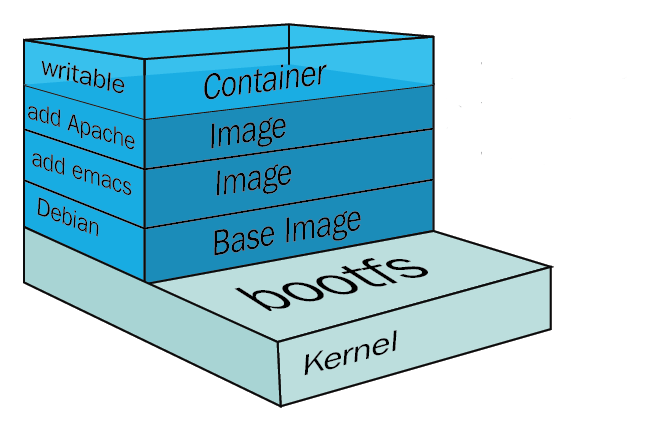

<!-- _backgroundImage: url('./../img/background-red.png') -->
<!-- _color: white -->

# 4 Desplegando Contenedores

---
# ¿Por qué contenedores?

> Containers offer a logical packaging mechanism in which applications can be abstracted from the environment in which they actually run. This decoupling allows container-based applications to be deployed easily and consistently, regardless of whether the target environment is a private data center, the public cloud, or even a developer’s personal laptop.

-- Google

---
# ¿Por qué contenedores?
Pero, ¿se puede hacer DevOps sin contenedores?

## **Sí!**

---
# ¿Por qué contenedores?

- Encapsulado de la aplicación junto a sus dependencias.
- Seguridad.
- Inmutabilidad.

---
# ¿Por qué contenedores?

Ahora, con la irrupción de los contenedores es más sencillo que nunca crear un `pipeline` de desarrollo que permita prácticas más modernas como las que normalmente se utilizan en cultura de equipos DevOps.


```
Code -> Build -> Test -> Deploy Staging -> Deploy Production
```

---
# ¿Por qué contenedores?

`docker run postgres`
`docker run python`
`docker run nginx`
...

---
## Docker

- ¿Qué es Docker?
- ¿Por qué Docker es tan popular hoy en día?
- ¿Puedo tener un equipo que siga la filosofía DevOps sin usar Docker?
- ¿Qué es una imagen de Docker?

---

## Pero.. ¿Qué es Docker?

Es el producto comercial multiplataforma que nos permite trabajar con contenedores fácilmente

Docker se creó en 2013 por Salomon Hykes. Hoy en día parece que _o despliegas contenedores docker o no eres nadie_ :D

---

<style>
img[alt~="center"] {
  display: block;
  margin: 0 auto;
}
</style>


---

<style>
img[alt~="center"] {
  display: block;
  margin: 0 auto;
}
</style>


---

## ¿Qué es una imágen de Docker?

<style>
img[alt~="center"] {
  display: block;
  margin: 0 auto;
}
</style>


---

## ¿Cómo se construyen las imágenes de Docker?

[Dockerfile](https://docs.docker.com/engine/reference/builder/) es nuestro amigo.

Es un formato de documento con instrucciones leídas en orden por Docker, y que interrumpe su ejecución si alguna de ellas falla.

---

### Ejemplo docker

Vamos a ejecutar la imagen `hello world` de Docker.

```
docker run hello-world
```

Y deberíamos ver:

```
Unable to find image 'hello-world:latest' locally
latest: Pulling from library/hello-world
ca4f61b1923c: Pull complete
Digest: sha256:ca0eeb6fb05351dfc8759c20733c91def84cb8007aa89a5bf606bc8b315b9fc7
Status: Downloaded newer image for hello-world:latest

Hello from Docker!
This message shows that your installation appears to be working correctly.
```

---

# ¿Puedo tener un equipo que siga la filosofía DevOps sin usar Docker?

### De nuevo, **Sí!**
Docker es una herramienta, no un requisito para aplicar DevOps.

---
## ACME Inc.


---

## ACME Inc.

Vamos a ir construyendo nuestro primer _producto_ en ACME Inc. La _welcome page_.

- `Dockerfile`
- nginx _configuration_
- `index.html`

Construimos _la imagen de docker_ con:

```
docker build -t acme-inc:1 .
```
---

## ACME Inc.

Ya tenemos la imagen de docker construida. La podemos _ver_ con:

`docker images`

```
$ docker images
REPOSITORY          TAG                 IMAGE ID            CREATED             SIZE
acme-inc            1                   8dcaea4ab748        6 minutes ago       127MB
nginx               latest              9beeba249f3e        8 days ago          127MB
hello-world         latest              bf756fb1ae65        4 months ago        13.3kB
```
---

## ACME Inc.

Vamos a _desplegar_ esta imagen en nuestro _local_.

- `docker run`

```
docker run --rm -p 8080:80 acme-inc:1
```

- `-p` indica que puertos queremos _mapear_ de la imagen a nuestro _localhost_.

---

## ACME Inc. - Ejercicio práctico

Hemos visto como podemos construir una imagen simple de nginx con nuestra configuración.

Vamos a llevar a ACME Inc. un pasito adelante y vamos a modificar la _welcome page_ a nuestro gusto con los siguientes requisitos:

- Página principal
- Página _sobre Acme Inc._
