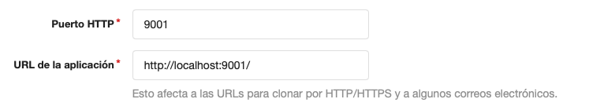
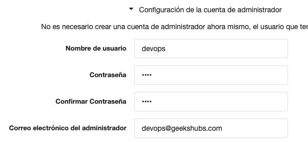

# Configuración del stack.

```
docker-compose -f docker-compose.yml up --build
```

## Jenkins

Seguir el wizard. (En el output de la consola saldrá el token)

## Registry

No hay que hacer ningún setup adicional

## Gogs

Seguir el wizard y crear un repositorio.

Seleccionar SQLlite como base de datos.

Configurar URL del servicio:



Configurar cuenta de administrador:


